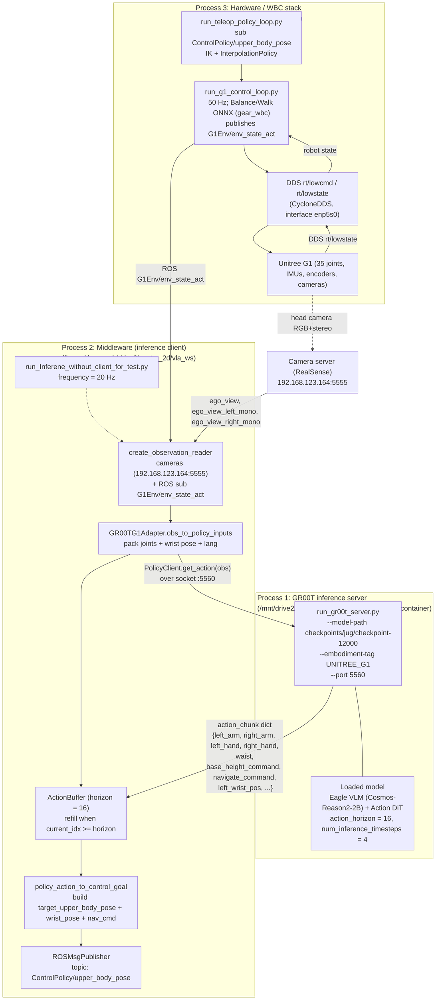
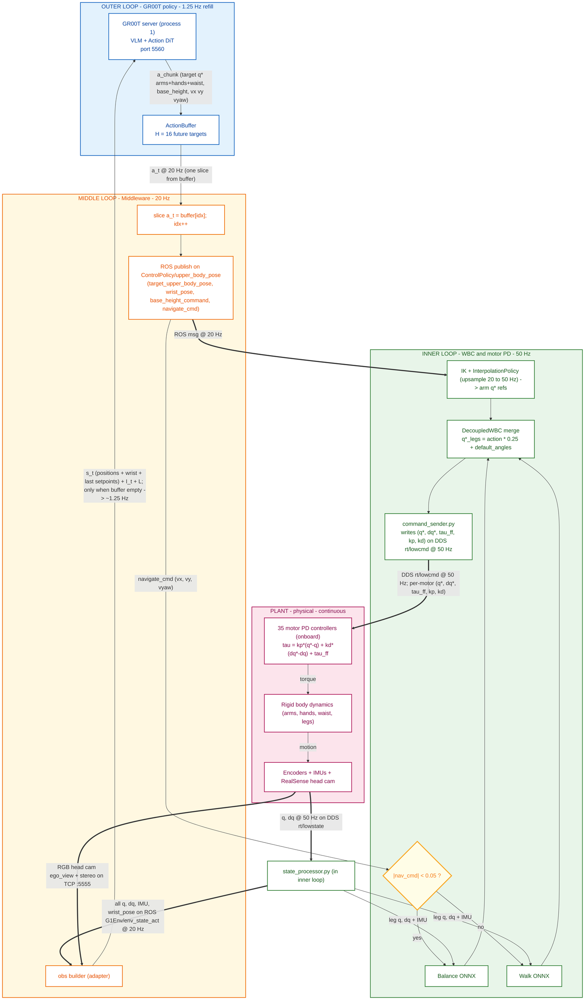

# GR00T Policy Inference — Hierarchical Control Architecture

> Companion to [`full_body_data_collection_overview.md`](./full_body_data_collection_overview.md) — focused on **how a trained GR00T manipulation policy runs on the real Unitree G1**.

The deployment is **three separate processes** that talk over the network:

1. **GR00T inference server** (`run_gr00t_server.py`, port `5560`) — loads the finetuned checkpoint, serves `policy.get_action(obs)` over a socket. Runs in the same container as training. `/mnt/drive2/groot_n1.7/Isaac-GR00T/notes.txt` has the exact launch commands.
2. **Middleware / inference client** (`/home/deepansh/drive2/g_star_2d/vla_ws/run_Inferene_without_client_for_test.py`) — reads sensor obs from ROS + the camera server, calls `PolicyClient.get_action(obs)` over the network, then publishes the resulting target pose on a ROS topic.
3. **Hardware control / WBC stack** (`run_g1_control_loop.py` + `run_teleop_policy_loop.py` from `full_body_data_collection/GR00T-WholeBodyControl/`) — subscribes to the middleware's topic, runs IK + WBC + RL balance/walk ONNX, sends DDS motor commands to the Unitree G1.

The middleware is the one that decouples the slow policy clock from the fast control clock — it pulls action chunks from the policy server and streams individual actions to the WBC stack at the control rate.

## Process layout



## Closed-loop control diagram

The Process-layout diagram above shows *where the code lives*. This one is drawn as a **classical control-block diagram**: action goes down, state comes back up, and the only true feedback closes through the **physical robot itself** (motors move the body → encoders/IMU/cameras observe the new state → policy decides next chunk).

Three nested loops at three different rates:

- **Outer loop (~1.25 Hz)** — GR00T policy refill. Reads obs, emits a 16-step action chunk.
- **Middle loop (20 Hz)** — Middleware tick. Drains one slice from the buffer per tick, publishes target pose on ROS.
- **Inner loop (50 Hz)** — WBC + motor PD. Subscribes to the target, runs IK + Balance/Walk ONNX, writes motor commands on DDS.



### How to read it

- **Bold arrows (`==>`)** are the *hot* data paths that close each loop:
  - Outer: `obs -> server -> a_chunk -> buffer`.
  - Middle: `buffer -> publish -> WBC`.
  - Inner: `WBC -> rt/lowcmd -> motors`; `motors -> body -> sensors -> state_processor -> back into WBC and (every 16 ticks) into the policy`.
- **Thin arrows** are auxiliary inputs (the velocity-norm switch, the Balance/Walk routing).
- **The only true feedback** is the bottom-to-top edge `SENS → state_processor → ...` which closes the loop *through the physical world*. Inside the software stack there is no shortcut from action back to policy — every state value the policy sees has been "filtered" by the physics of the robot moving.

### What sets each loop's rate

| Loop | Rate | What sets it | Where to find it |
|------|------|--------------|------------------|
| Inner | 50 Hz | `--control_frequency 50` | `full_body_data_collection/notes.txt`; `run_g1_control_loop.py` |
| Middle | 20 Hz | `config.frequency = 20` | `run_Inferene_without_client_for_test.py:34` |
| Outer | ~1.25 Hz | Middle rate / action horizon = 20 / 16 | derived; refill triggered by `ActionBuffer.needs_update()` |
| Plant | continuous (physical) | physics + motor bandwidth | onboard PD runs much faster than 50 Hz |

### Where each loop "breaks" if something goes wrong

- **Outer breaks** → middleware keeps draining the same stale chunk past index 15; usually means the policy server is unreachable or slow. Symptom: actions repeat or jump when a new chunk finally arrives.
- **Middle breaks** → no new `ControlPolicy/upper_body_pose` ROS msgs; `InterpolationPolicy` will hold/extrapolate the last upper-body target. Symptom: upper body freezes while lower body keeps balancing.
- **Inner breaks** → no DDS `rt/lowcmd`; motors enter their fault/damp mode (`PosStopF`, `VelStopF`, `kp = 0`, `kd = 0`) configured in `command_sender.py:66-70`. Symptom: robot collapses or holds last position depending on motor mode.

## What the middleware actually exchanges with the server

The adapter (`GR00TG1Adapter.obs_to_policy_inputs`, line 96 in `run_Inferene_without_client_for_test.py`) packs the observation in the exact shape the GR00T model expects:

```python
model_obs = {
    "video": {
        "ego_view":            obs["ego_view"],            # RGB
        "ego_view_left_mono":  obs["ego_view_left_mono"],  # stereo L
        "ego_view_right_mono": obs["ego_view_right_mono"], # stereo R
    },
    "state": {
        # 7 joint groups (positions only):
        "left_leg":  obs["left_leg.pos"],   # 6
        "right_leg": obs["right_leg.pos"],  # 6
        "waist":     obs["waist.pos"],      # 3
        "left_arm":  obs["left_arm.pos"],   # 7
        "left_hand": obs["left_hand.pos"],  # 7
        "right_arm": obs["right_arm.pos"],  # 7
        "right_hand":obs["right_hand.pos"], # 7
        # End-effector pose (from FK in the WBC stack):
        "left_wrist_pos":       obs["left_wrist_pos"],       # 3
        "left_wrist_abs_quat":  obs["left_wrist_abs_quat"],  # 4 (w,x,y,z)
        "right_wrist_pos":      obs["right_wrist_pos"],      # 3
        "right_wrist_abs_quat": obs["right_wrist_abs_quat"], # 4
        # Last-commanded base setpoints (echoed back as obs):
        "base_height_command":  obs["base_height_command"],  # 1
        "navigate_command":     obs["navigate_command"],     # 3 (vx, vy, vyaw)
    },
    "language": {
        "annotation.human.task_description": lang_instruction,
    },
}
# B and T dims added: every leaf becomes shape (1, 1, D)
```

The server replies with an `action_chunk` dict where every value has shape `(B=1, T=H, D)`, with the same 7 action groups: `left_arm`, `right_arm`, `left_hand`, `right_hand`, `waist`, `base_height_command`, `navigate_command` (plus the wrist pose targets in the current adapter).

## What the middleware publishes onto ROS

`policy_action_to_control_goal` (line 153) builds a dict that matches the format `run_teleop_policy_loop.py` already consumes (same shape Pico teleop uses):

```python
control_cmd = {
    "target_upper_body_pose": concat([left_arm(7), left_hand(7),
                                       right_arm(7), right_hand(7)]),    # 28
    "wrist_pose":             concat([left_wrist_pos(3), ...]),           # currently only left_wrist_pos
    "base_height_command":    float,                                       # m
    "navigate_cmd":           [vx, vy, vyaw],                              # m/s, m/s, rad/s
    "toggle_policy_action":   False,
    "toggle_data_collection": False,
    "toggle_data_abort":      False,
    "timestamp":              now,
    "target_time":            now + 1.0/freq,
}
# published on ROS topic: ControlPolicy/upper_body_pose
```

Note the policy outputs are **target joint positions** (and a base velocity setpoint), **not torques**. The downstream stack does PD + force production.

## Signal legend (with quantity types)

Each signal carries a **specific physical quantity** — position, velocity, torque, or a setpoint. Highlights which fields each stage actually consumes.

| Signal | Quantity type | Contents | Dim | Rate |
|--------|---------------|----------|-----|------|
| `I_t` | image | `ego_view` (RGB) + `ego_view_left_mono` + `ego_view_right_mono` from RealSense head | 3 × frame | ~20 Hz (middleware tick) |
| `L` | text | Task prompt (constant per episode) | — | 1× per episode |
| `q` | **position** (rad) | All 35 joint positions from `motor_state[i].q` | 35 | 50 Hz |
| `dq` | **velocity** (rad/s) | All 35 joint velocities from `motor_state[i].dq` | 35 | 50 Hz |
| `tau_est` | **torque estimate** (Nm) | Measured torque from `motor_state[i].tau_est` | 35 | 50 Hz |
| IMU | orientation + ang.vel + lin.acc | `imu_state.quaternion` + `gyroscope` + `accelerometer` + torso IMU | 4 + 3 + 3 + 7 | 50 Hz |
| wrist pose | **EE position + orientation** | `left_wrist_pos` (3) + `left_wrist_abs_quat` (4) + same for right | 14 | 50 Hz (from FK in WBC) |
| `s_t` (GR00T input) | **positions + EE pose only** | 7 joint groups (positions) + wrist pose + last base setpoints. **No dq, no tau.** | grouped (`max_state_dim=132`) | sampled at 20 Hz |
| `a_chunk` (GR00T output) | **target positions + setpoints** | `H=16` future steps × 7 groups: target joint angles for `left/right_arm`, `left/right_hand`, `waist`; `base_height_command` (m); `navigate_command` (vx, vy, vyaw) | padded to `max_action_dim=132` × 16 | ~1.25 Hz refill (one chunk drains over 16 ticks @ 20 Hz = 0.8 s) |
| `a_t` | one slice of `a_chunk` | `target_upper_body_pose` + `wrist_pose` + `base_height_command` + `navigate_cmd` | 28 + 3 + 1 + 3 | 20 Hz |
| Balance/Walk ONNX out | **delta around default pose** | 15 leg joints, then `target_q = action * 0.25 + default_angles` | 15 | 50 Hz |
| `u_motor` (`rt/lowcmd`) | **PD + feedforward** | `cmd.q` (target pos) + `cmd.dq` (target vel) + `cmd.tau` (FF torque) + `cmd.kp` + `cmd.kd`; motor computes `tau = kp(cmd.q − q) + kd(cmd.dq − dq) + cmd.tau` | 5 fields × 35 motors | 50 Hz |

**Per-stage cheat sheet — what each process reads/writes:**

| Stage | Reads | Writes |
|-------|-------|--------|
| Camera server (RealSense) | head cameras | `ego_view`, `ego_view_left_mono`, `ego_view_right_mono` on TCP `:5555` |
| `state_processor.py` (in WBC stack) | DDS `rt/lowstate` → q, dq, tau_est, ddq, IMU, odom | concatenated state on ROS topic `G1Env/env_state_act` |
| Middleware obs reader | images (TCP) + state (ROS) | `obs` dict (positions + wrist pose + last setpoints + images) |
| Middleware adapter | obs dict | `model_obs` for the policy server |
| **GR00T policy server (process 1)** | `model_obs` | `action_chunk` (16-step target positions + base setpoints) |
| Middleware action buffer + converter | `action_chunk` | `control_cmd` on ROS topic `ControlPolicy/upper_body_pose` (20 Hz) |
| `run_teleop_policy_loop.py` | `control_cmd` | upper-body joint refs to IK + InterpolationPolicy |
| Balance/Walk ONNX | leg q, dq, IMU, base velocity setpoint | leg deltas → target q* |
| `command_sender.py` | combined targets | per-motor `(q*, dq*, tau_ff, kp, kd)` on DDS `rt/lowcmd` |

> **GR00T is not a torque controller.** It outputs target joint positions; the low-level PD loop inside each Unitree motor does the actual force production.

## Three clocks (not two)

All three rates are independently set — the middleware deliberately matches the **20 Hz data-collection rate** that the training data was recorded at (`--data_collection_frequency 20` in `full_body_data_collection/notes.txt`); the WBC inner loop is **50 Hz** (`--control_frequency 50` / `--teleop-frequency 50` from the same notes); the policy refill rate is derived (= middleware tick / action horizon).

| Clock | Rate | Source / setting | Driven by |
|-------|------|------------------|-----------|
| **Inner control** | **50 Hz** | `run_g1_control_loop.py --control_frequency 50` and `run_teleop_policy_loop.py --teleop-frequency 50 --control_frequency 50` | `run_g1_control_loop.py` — Balance/Walk ONNX + `command_sender.py` writing `rt/lowcmd` DDS @ 50 Hz |
| **Middleware tick** | **20 Hz** | `config.frequency = 20` in `run_Inferene_without_client_for_test.py` (line 34, comment `# Hz   fix 10` flags a TODO to drop to 10 Hz). Matches the dataset's recording rate `--data_collection_frequency 20`. | `run_Inferene_without_client_for_test.py` — `rate = node.create_rate(20)`; each tick: read obs, pull one slice from `ActionBuffer`, publish `ControlPolicy/upper_body_pose` |
| **Policy refill** | **~1.25 Hz** (every `H = 16` middleware ticks ≈ 0.8 s) | Derived: `middleware_rate / action_horizon = 20 / 16`. Triggered when `ActionBuffer.needs_update()` returns true. | One forward pass through Eagle VLM + Action DiT on the policy server (process 1) |

Why the **middleware Hz = training data Hz** matters: the policy was trained on observation/action pairs spaced at 20 Hz, so the per-step action delta the model emits is calibrated for a 20 Hz dispatch. Running the middleware faster (50 Hz) without retraining would cause the robot to overshoot every target; slower (10 Hz, the "fix" note) would feel sluggish unless `H` is shrunk proportionally.

Between middleware and motors there is an extra upsampling stage — `InterpolationPolicy` (inside `run_teleop_policy_loop.py`) smoothly interpolates the 20 Hz upper-body target stream to the 50 Hz inner control loop, so the motors always see a fresh setpoint at 50 Hz.

End-to-end fresh-decision latency on the real robot is therefore:

```
camera capture  +  obs build  +  network RPC  +  VLM+DiT forward  +  buffer drain  +  WBC tick  +  motor PD
   ~ms             ~10 ms        ~ms            tens to hundreds     up to 0.8 s     ~5 ms        onboard
```

The dominant terms are the **policy forward pass** and the **action-buffer drain** — once a chunk is in the buffer, every motor command for the next 0.8 s rides on that one policy decision (only 1 in 16 motor commands corresponds to a freshly minted action).

## Inference loop (heart of it — middleware side)

From `run_Inferene_without_client_for_test.py:main`:

```python
# Setup (once)
obs_reader     = create_observation_reader(camera_host, camera_port,
                                           state_topic_name=STATE_TOPIC_NAME,
                                           frequency=20,
                                           add_stereo_camera=True)
policy_client  = PolicyClient(host="localhost", port=5560)
adapter        = GR00TG1Adapter(policy_client, add_stereo_camera=True)
action_buffer  = ActionBuffer()
control_publisher = ROSMsgPublisher(CONTROL_GOAL_TOPIC)  # ControlPolicy/upper_body_pose
rate = node.create_rate(20)

while rclpy.ok():
    obs = obs_reader.get_observation(lang_instruction)             # cameras + ROS state

    if action_buffer.needs_update():                               # every H=16 ticks
        action_chunk, info = adapter.get_action(obs)               # RPC to policy server
        action_buffer.set_actions(action_chunk)

    current_action = action_buffer.get_current_action()            # slice (B,1,D)
    control_cmd    = policy_action_to_control_goal(current_action, # build teleop-format dict
                                                   now, freq=20)
    control_publisher.publish(control_cmd)                         # -> ControlPolicy/upper_body_pose
    action_buffer.advance()
    rate.sleep()
```

So the **policy server is called once every ~0.8 s**, but `ControlPolicy/upper_body_pose` is published at **20 Hz**; the WBC stack consumes those targets and produces motor commands at **50 Hz**.

## What `policy.get_action(model_obs)` does on the server

1. **Image branch:** the three camera frames → vision encoder (Eagle VLM backbone, Cosmos-Reason2-2B).
2. **State branch:** joint positions (7 groups) + wrist pose + last base setpoints → state encoder.
3. **Language branch:** `annotation.human.task_description` → tokenizer (cached if constant).
4. **Backbone fusion:** Eagle VLM produces `vl_embs` + `sa_embs`.
5. **Action DiT:** diffusion transformer denoises for `num_inference_timesteps = 4` steps, producing an action chunk of `action_horizon = 16` future actions across 7 groups.
6. **Reply:** dict of `(B=1, T=16, D)` tensors over the socket back to the middleware.

## Launching the three processes

```bash
# Process 1 — GR00T inference server (inside sam_container)
python3 run_gr00t_server.py \
    --model-path /workspace/checkpoints/jug/checkpoint-12000 \
    --embodiment-tag UNITREE_G1 \
    --port 5560

# Process 3 — Hardware control + WBC stack (inside gr00t_wbc-bash-root container)
export GR00T_WBC_TMUX_SESSION=g1_deployment
python /root/Projects/GR00T-WholeBodyControl/gr00t_wbc/control/main/teleop/run_g1_control_loop.py \
    --wbc_version gear_wbc \
    --wbc_model_path policy/GR00T-WholeBodyControl-Balance.onnx,policy/GR00T-WholeBodyControl-Walk.onnx \
    --wbc_policy_class GIDecoupledWholeBodyPolicy \
    --interface enp5s0 \
    --control_frequency 50 \
    --no-enable_waist --with_hands --no-high_elbow_pose --no-enable_gravity_compensation

python /root/Projects/GR00T-WholeBodyControl/gr00t_wbc/control/main/teleop/run_teleop_policy_loop.py \
    --body_control_device pico --hand_control_device pico \
    --enable_real_device --teleop-frequency 50 --control_frequency 50 --no-binary-hand-ik

# Process 2 — Middleware (inference client)
cd /home/deepansh/drive2/g_star_2d/vla_ws
python3 run_Inferene_without_client_for_test.py \
    --policy-host localhost --policy-port 5560 \
    --camera-host 192.168.123.164 --camera-port 5555 \
    --frequency 20
```

## TL;DR — the hierarchy with three processes

```
Process 1 (GR00T server, port 5560)
   ^                                                    PolicyClient RPC
   |  model_obs (positions + wrist + images + lang)         (~1.25 Hz)
   |  action_chunk (16 future targets)
   v
Process 2 (Middleware, 20 Hz)
   ^                                                    obs from cameras (TCP)
   |                                                    + state from ROS topic G1Env/env_state_act
   |  control_cmd published on ROS topic
   v   ControlPolicy/upper_body_pose (20 Hz)
Process 3 (WBC + Hardware, 50 Hz)
   ^                                                    DDS rt/lowstate -> ROS state topic
   |  WBC pipeline: IK + InterpolationPolicy + Balance/Walk ONNX
   v   command_sender.py -> DDS rt/lowcmd (q*, dq*, tau_ff, kp, kd) per motor
Unitree G1 (50 Hz physical loop, motor PD: tau = kp(q*-q) + kd(dq*-dq) + tau_ff)
```
