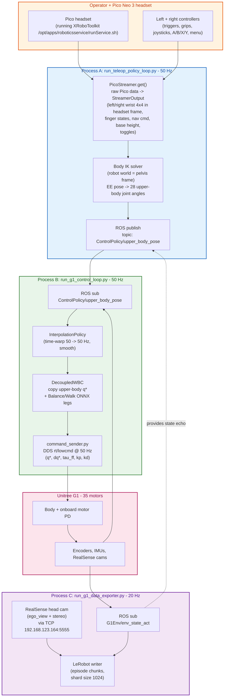
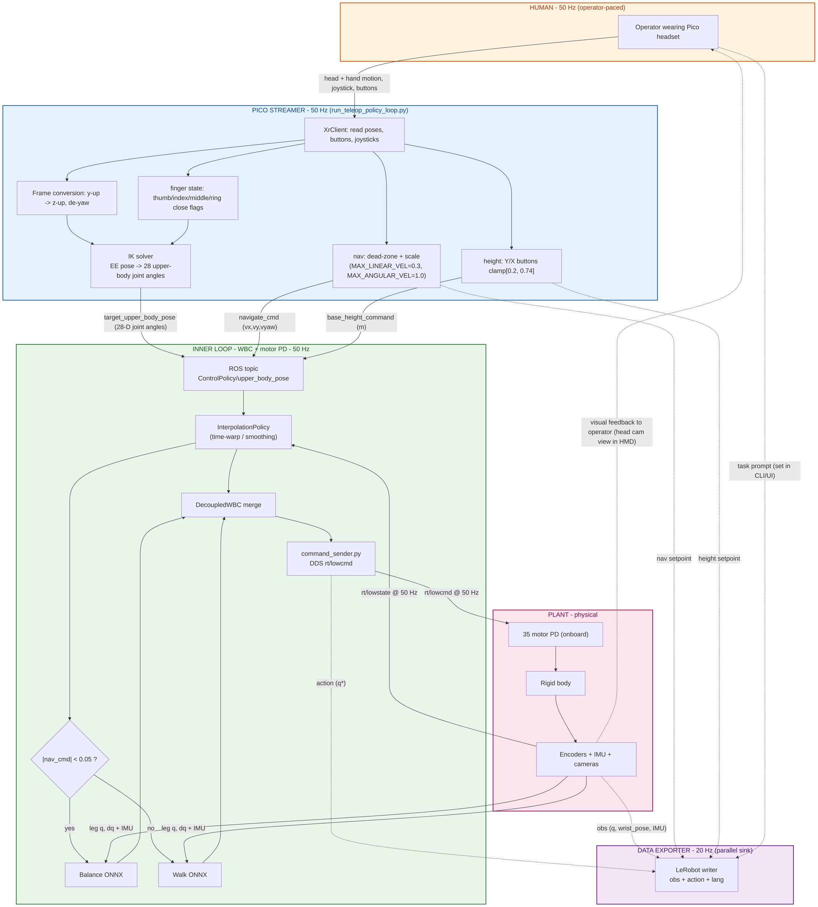

# Teleoperation & Data Collection — Unitree G1 + Pico VR

> Companion to [`inference.md`](./inference.md) and [`full_body_data_collection_overview.md`](./full_body_data_collection_overview.md).
> This doc focuses on the **teleop path** — how a human operator wearing a Pico VR headset drives the G1 to record demonstrations that GR00T later trains on. Architecturally it's the **same WBC stack as inference**, with the Pico replacing the GR00T policy server as the source of upper-body + base setpoints.

## How teleop relates to inference

| | Teleop / data collection | GR00T inference |
|---|--------------------------|-----------------|
| Source of upper-body targets | **Human via Pico controllers** (`pico_streamer.py` → IK solver) | **GR00T model** (`run_gr00t_server.py` over ZMQ) |
| Source of `navigate_cmd` | Left joystick | Policy output `navigate_command` |
| Source of `base_height_command` | X / Y buttons | Policy output `base_height_command` |
| Downstream (WBC + motor PD) | **Identical** | **Identical** |
| Extra process | — | Middleware (`run_Inferene_without_client_for_test.py`) |
| Extra process for data | `run_g1_data_exporter.py` writes LeRobot dataset at 20 Hz | (not used) |

Everything in `inference.md`'s closed-loop control diagram from the **MIDDLE LOOP** downward stays the same — only the producer of `ControlPolicy/upper_body_pose` changes.

## Process layout (teleop)



## The three processes (teleop mode)

### Process A — `run_teleop_policy_loop.py` (Pico → ROS)

Reads Pico controller data at 50 Hz, solves IK, publishes `ControlPolicy/upper_body_pose`.

```bash
/root/venv/bin/python /root/Projects/GR00T-WholeBodyControl/gr00t_wbc/control/main/teleop/run_teleop_policy_loop.py \
  --body_control_device pico \
  --hand_control_device pico \
  --body_streamer_ip 10.112.210.229 \
  --body_streamer_keyword knee \
  --no-enable_waist \
  --no-high_elbow_pose \
  --no-enable_visualization \
  --enable_real_device \
  --upper-body-joint-speed 50 \
  --teleop-frequency 50 \
  --control_frequency 50 \
  --no-binary-hand-ik
```

Key flags:
- `--body_control_device pico`, `--hand_control_device pico` → use `PicoStreamer` for both arm pose and finger state.
- `--body_streamer_ip 10.112.210.229` → IP of the Pico headset on the LAN.
- `--teleop-frequency 50`, `--control_frequency 50` → both run at 50 Hz (teleop's freshness rate matches the WBC inner loop; no 20 → 50 Hz upsampling needed, unlike inference).
- `--no-enable_waist` → waist joints stay at default, not driven by teleop.
- `--no-binary-hand-ik` → use the analog finger IK (continuous-position fingers) not the open/close binary mode.

### Process B — `run_g1_control_loop.py` (WBC + DDS)

**Identical to inference**. Same flags, same binary, same Balance/Walk ONNX.

```bash
export GR00T_WBC_TMUX_SESSION=g1_deployment
/root/venv/bin/python /root/Projects/GR00T-WholeBodyControl/gr00t_wbc/control/main/teleop/run_g1_control_loop.py \
  --wbc_version gear_wbc \
  --wbc_model_path policy/GR00T-WholeBodyControl-Balance.onnx,policy/GR00T-WholeBodyControl-Walk.onnx \
  --wbc_policy_class GIDecoupledWholeBodyPolicy \
  --interface enp5s0 \
  --simulator None \
  --control_frequency 50 \
  --no-enable_waist \
  --with_hands \
  --no-high_elbow_pose \
  --no-enable_gravity_compensation
```

### Process C — `run_g1_data_exporter.py` (LeRobot writer, 20 Hz)

Subscribes to robot state + cameras, writes a LeRobot-format dataset to disk.

```bash
export GR00T_WBC_TMUX_SESSION=g1_data_export
/root/venv/bin/python /root/Projects/GR00T-WholeBodyControl/gr00t_wbc/control/main/teleop/run_g1_data_exporter.py \
  --data_collection_frequency 20 \
  --root_output_dir outputs \
  --lower_body_policy gear_wbc \
  --wbc_model_path "policy/GR00T-WholeBodyControl-Balance.onnx,policy/GR00T-WholeBodyControl-Walk.onnx" \
  --camera_host 192.168.123.164 \
  --camera_port 5555
```

Key:
- `--data_collection_frequency 20` — recording rate. **This is the rate the GR00T policy is later trained against**, which is why the inference middleware also runs at 20 Hz.
- `--camera_host 192.168.123.164 --camera_port 5555` — the same RealSense composed-camera server used at inference.

The dataset rows it writes:
- `observation.images.ego_view` (+ stereo channels)
- `observation.state` — full joint vector + wrist pose
- `observation.eef_state` — wrist pose copy (from `last_teleop_cmd["wrist_pose"]`)
- `action` — 35-D `q*` (the actual commanded joint targets from WBC)
- `action.eef` — wrist pose target (currently same as observation)
- `base_height_command`, `navigate_command`
- `annotation.human.task_description` — text prompt (set externally per episode)

## What `pico_streamer.py` produces

`PicoStreamer.get()` returns a `StreamerOutput` with four sub-dicts. **Source:** `gr00t_wbc/control/teleop/streamers/pico_streamer.py`.

### `ik_data` — for the IK solver

| Key | Type | Frame |
|-----|------|-------|
| `left_wrist` | 4×4 homogeneous transform | **headset world frame, z-up** (yaw-compensated to remove operator's head rotation) |
| `right_wrist` | 4×4 homogeneous transform | same |
| `left_fingers["position"]` | (25, 4, 4) fingertip array (only entries 4+thumb / 4+index / 4+middle / 4+ring carry signal — `[0,3] = 1.0` means "close that finger") | — |
| `right_fingers["position"]` | same | — |

**Frame conversion** (`pico_streamer.py:9-15`, `_process_xr_pose`):
- Pico XR is y-up. Code rotates everything by `R_HEADSET_TO_WORLD = [[0,0,-1],[-1,0,0],[0,1,0]]` to a z-up frame.
- Controller position is expressed **relative to the headset** (controller − headset), then de-yawed by the headset's z-axis rotation. So when the operator turns their head left, the robot does not turn its arms left — only relative hand motion drives the arms.

### `control_data` — for the lower body + base

| Key | Source | Range / units |
|-----|--------|---------------|
| `base_height_command` | Y / X buttons (±0.01 m per call when held) | clamped to `[0.20, 0.74]` m, init 0.74 |
| `navigate_cmd` | Left stick = `(vx, vy)`, right stick X = `vyaw` | dead zone 0.1; `MAX_LINEAR_VEL = 0.3 m/s`, `MAX_ANGULAR_VEL = 1.0 rad/s` |
| `toggle_policy_action` | `left_menu + left_trigger > 0.5` (rising edge) | bool |

Frames / signs:
- `lin_vel_x = +left_joystick[1]` → push stick **up** = forward (`+vx`).
- `lin_vel_y = −left_joystick[0]` → push stick **left** = `+vy` (left strafe).
- `ang_vel_z = −right_joystick[0]` → push stick **left** = `+vyaw` (CCW from above).

These are in **body / pelvis-yaw frame**, same as `navigate_cmd` consumed by the Walk/Balance ONNX — *no further transformation in the WBC stack*.

### `teleop_data`

| Key | Source | Effect |
|-----|--------|--------|
| `toggle_activation` | `left_menu + right_trigger > 0.5` (rising edge) | Activate / deactivate teleop ingestion |

### `data_collection_data`

| Key | Source | Effect |
|-----|--------|--------|
| `toggle_data_collection` | `A` button (rising edge) | Start / stop a recording episode in the exporter |
| `toggle_data_abort` | `B` button (rising edge) | Abort the current recording (discard) |

## Control-block diagram (teleop path)



The **closed loop is via the operator's eyes** — the head-mounted display streams the robot's ego-view camera back to the operator, who reacts and moves their hands accordingly. That's the "policy" during teleop.

## Two clocks (not three — there's no policy refill)

| Clock | Rate | Driven by |
|-------|------|-----------|
| **Inner control** | **50 Hz** | `run_g1_control_loop.py` (same as inference) |
| **Teleop tick** | **50 Hz** | `run_teleop_policy_loop.py --teleop-frequency 50` → `PicoStreamer.get()` is called at 50 Hz, publishes `ControlPolicy/upper_body_pose` at 50 Hz |
| **Data export** | **20 Hz** | `run_g1_data_exporter.py --data_collection_frequency 20` — independent sink, doesn't affect control |

So in teleop the upper-body target is **fresh every 50 Hz** (matches the inner loop rate), but the dataset is **sampled at 20 Hz** for storage. Compare with inference where the policy refills at ~1.25 Hz and the middleware drains at 20 Hz.

## Button / control mapping (reference)

| Pico input | Effect |
|------------|--------|
| Left stick Y | `vx` (forward / back) |
| Left stick X (negated) | `vy` (left / right strafe) |
| Right stick X (negated) | `vyaw` (turn) |
| `Y` (hold) | base height += 0.01 m / tick (cap 0.74) |
| `X` (hold) | base height −= 0.01 m / tick (floor 0.20) |
| `A` (press, rising edge) | toggle data collection ON/OFF |
| `B` (press, rising edge) | abort current recording episode |
| `left_menu + left_trigger` (rising edge) | toggle `policy_action` (used when feeding RL policy commands manually) |
| `left_menu + right_trigger` (rising edge) | toggle teleop activation (master enable) |
| `right_trigger` (no menu) | close index finger |
| `right_grip` (no menu) | close ring finger |
| `right_trigger + right_grip` (no menu) | close middle finger |
| Thumb fingertip | always set to "open" (1.0) — placeholder; thumb tracked via headset hand-tracking when enabled |

(Same scheme mirrored on the left hand.)

## Frames cheat sheet (teleop-specific bits, on top of inference doc)

| Signal | Frame in Pico data | Frame after streamer | Frame consumed by WBC |
|--------|--------------------|-----------------------|-----------------------|
| Controller pose | XR / headset world (y-up) | z-up, headset-relative, yaw-compensated | passed to IK solver, which solves in **pelvis (robot world) frame** |
| `navigate_cmd` | joystick axes (unitless) | scaled to m/s + rad/s in **body / pelvis-yaw frame** | identical |
| `base_height_command` | button counter (m) | metres, **pelvis Z above floor** | identical |
| `wrist_pose` (recorded in dataset) | n/a | computed by FK from robot's current `q` in **pelvis frame** (scalar-first quat) | logged only; not a control target |

## End-to-end teleop pipeline (one sentence)

The operator's hand motion is read at 50 Hz by `PicoStreamer`, converted from headset-y-up to pelvis-z-up frame with yaw compensation, fed through an IK solver to produce 28-D upper-body joint targets plus joystick-derived `(vx, vy, vyaw)` and button-derived `base_height_command`; these are published on `ControlPolicy/upper_body_pose` at 50 Hz; `InterpolationPolicy` + `DecoupledWBC` merge them with Balance/Walk ONNX leg targets into a 35-D `q*`; `command_sender` writes per-motor `(q*, 0, 0, kp, kd)` onto DDS `rt/lowcmd` at 50 Hz; the data exporter samples the resulting (obs, action, lang) tuple at 20 Hz into a LeRobot dataset — the same 20 Hz rate the GR00T policy is later trained against.
